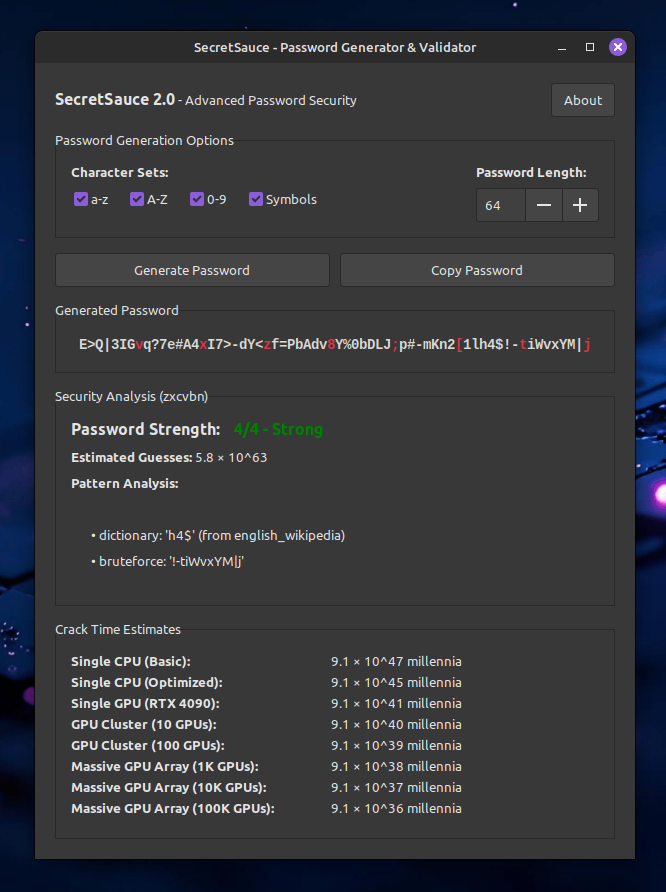

# SecretSauce 🔐

**Advanced Password Generator & Security Validator with GTK3 GUI**

SecretSauce is a comprehensive password security tool that generates ultra-secure passwords and validates them through 16+ advanced analysis methods. Built with Python and GTK3, it provides real-time security feedback to help you create unbreakable passwords.



## ✨ Features

### 🎲 **Advanced Password Generation**
- **Customizable length**: 8 to 4,096 characters
- **Character set selection**: Lowercase, uppercase, digits, symbols
- **Smart distribution**: Ensures all selected character types are represented
- **Pattern avoidance**: Automatically prevents predictable sequences
- **Visual highlighting**: Every 8th character highlighted in red for easy partial copying

### 🔍 **Comprehensive Security Analysis (16+ Methods)**
- **Basic Security**: Length, character classes, unique character count
- **Pattern Detection**: Repeated sequences, ASCII sequences, palindromes
- **Entropy Analysis**: Shannon entropy, positional entropy variation
- **Advanced Algorithms**: Bigram uniformity, Lempel-Ziv complexity
- **Keyboard Analysis**: Adjacency complexity, ergonomics scoring
- **Visual Security**: Similar character detection, case switching analysis
- **Distribution Analysis**: Symbol positioning, digit padding detection
- **Frequency Analysis**: Character distribution skewness

### 🖥️ **User Experience**
- **Clean GTK3 interface** that integrates with your desktop
- **Real-time validation** with color-coded results (✓ ⚠ ✗)
- **Auto-generation** on startup
- **One-click copying** to clipboard
- **Detailed scoring** (0-100) for each security metric
- **Compact layout** optimized for efficiency

## 📦 Installation

### System Requirements
- **Linux** (GTK3 desktop environment)
- **Python 3.6+**
- **GTK3 development libraries**

### Install GTK3 Dependencies

**Ubuntu/Debian:**
```bash
sudo apt install python3-gi python3-gi-cairo gir1.2-gtk-3.0
```

**Fedora:**
```bash
sudo dnf install python3-gobject gtk3-devel
```

**Arch Linux:**
```bash
sudo pacman -S python-gobject gtk3
```

### Download and Run
```bash
# Clone the repository
git clone https://github.com/drfuera/SecretSauce.git
cd SecretSauce

# Run SecretSauce
python3 password.py
```

That's it! SecretSauce will automatically check dependencies and generate your first secure password.

## 🚀 Quick Start

1. **Launch** SecretSauce: `python3 password.py`
2. **Customize** character sets and password length
3. **Generate** a password with the big button
4. **Review** the security analysis results
5. **Copy** your secure password to clipboard

## 🔬 Security Analysis Methods

SecretSauce evaluates password strength through multiple sophisticated algorithms:

| Category | Methods | Purpose |
|----------|---------|---------|
| **Basic Security** | Length, Character Classes, Unique Characters | Foundation security metrics |
| **Pattern Detection** | Repeated Sequences, ASCII Sequences, Palindromes | Identifies predictable patterns |
| **Entropy Analysis** | Shannon Entropy, Positional Entropy | Measures randomness and uniformity |
| **Keyboard Security** | Adjacency Analysis, Traversal Complexity | Evaluates typing patterns |
| **Advanced Analysis** | Lempel-Ziv Complexity, Bigram Uniformity | Compression and sequence analysis |
| **Visual Security** | Similar Characters, Case Switching | Human perception vulnerabilities |
| **Distribution** | Symbol Positioning, Digit Padding | Character placement analysis |

Each method provides a score (0-100) and detailed feedback to help you understand password strength.

## 🎯 Use Cases

- **Personal Security**: Generate strong passwords for personal accounts
- **Enterprise Security**: Validate password policies and requirements  
- **Security Research**: Analyze password strength metrics and patterns
- **Education**: Learn about password security and cryptographic principles
- **Development**: Integrate password analysis into other security tools

## 🛠️ Configuration

SecretSauce works out of the box with sensible defaults:
- **Default length**: 64 characters
- **All character sets enabled**: a-z, A-Z, 0-9, symbols
- **Auto-generation on startup**
- **Optimized for maximum security**

Customize through the GUI:
- Adjust password length (8-4096 characters)
- Toggle character sets on/off
- Generate multiple passwords
- Copy individual passwords

## 📱 Desktop Integration

SecretSauce is designed to integrate seamlessly with Linux desktop environments:
- **GTK3 native interface** matches your theme
- **Standard keyboard shortcuts** 
- **Clipboard integration** for easy password copying
- **About dialog** with project information
- **Responsive design** works on various screen sizes

## 🤝 Contributing

We welcome contributions! Here's how you can help:

### 🐛 **Bug Reports**
- Use the [Issues](https://github.com/drfuera/SecretSauce/issues) page
- Include your Linux distribution and Python version
- Describe steps to reproduce the issue

### 💡 **Feature Requests**
- Suggest new security analysis methods
- Propose UI/UX improvements
- Request additional password generation options

### 🔧 **Code Contributions**
- Fork the repository
- Create a feature branch: `git checkout -b feature-name`
- Make your changes and test thoroughly
- Submit a pull request with a clear description

### 📊 **Security Research**
- Propose new password analysis algorithms
- Share research on password security patterns
- Help improve existing analysis methods

## 📋 Technical Details

### Architecture
- **Frontend**: GTK3 with Python GObject bindings
- **Backend**: Pure Python with standard library modules
- **Security**: No network connections, all analysis performed locally
- **Performance**: Optimized for real-time analysis of long passwords

### Dependencies
- **Required**: Python 3.6+, GTK3, PyGObject
- **Optional**: None (all analysis uses standard library)
- **Size**: ~50KB Python code, minimal footprint

### Security Design
- **Local processing**: No data transmitted over network
- **Memory safety**: Passwords not stored persistently
- **Clipboard integration**: Standard system clipboard only
- **No telemetry**: No usage data collected

## 📈 Roadmap

### Version 1.1 (Planned)
- [ ] Additional entropy analysis methods
- [ ] Password strength visualization charts
- [ ] Export analysis results to CSV/JSON
- [ ] Custom symbol sets

### Version 1.2 (Future)
- [ ] Batch password analysis
- [ ] Password policy compliance checking
- [ ] Integration with password managers
- [ ] Command-line interface

### Long-term
- [ ] Multi-language support
- [ ] Windows/macOS ports
- [ ] Plugin architecture for custom analysis
- [ ] Password breach database checking

## 🏆 Why SecretSauce?

| Feature | SecretSauce | Other Tools |
|---------|-------------|-------------|
| **Analysis Methods** | 16+ comprehensive | Usually 3-5 basic |
| **Password Length** | Up to 4,096 chars | Often limited to 64 |
| **Real-time Feedback** | ✓ Instant analysis | Often batch only |
| **Open Source** | ✓ CC BY License | Many proprietary |
| **Desktop Integration** | ✓ Native GTK3 | Often web-based |
| **Privacy** | ✓ 100% local | Many cloud-based |
| **Educational** | ✓ Detailed explanations | Usually just scores |

## 📄 License

**Creative Commons Attribution (CC BY)**

You are free to:
- **Share** — copy and redistribute the material in any medium or format
- **Adapt** — remix, transform, and build upon the material for any purpose, even commercially

Under the following terms:
- **Attribution** — You must give appropriate credit to Andrej Fuera

See [LICENSE](LICENSE) for the complete terms.

## 👨‍💻 Author

**Andrej Fuera** - Created with Claude

- GitHub: [@drfuera](https://github.com/drfuera)
- Project: [SecretSauce](https://github.com/drfuera/SecretSauce)

## 🔗 Links

- **Repository**: https://github.com/drfuera/SecretSauce
- **Issues**: https://github.com/drfuera/SecretSauce/issues
- **Releases**: https://github.com/drfuera/SecretSauce/releases
- **License**: Creative Commons Attribution (CC BY)

---

**🔐 Stay secure, stay protected with SecretSauce!**

*Made with ❤️ for the open source and security community*
